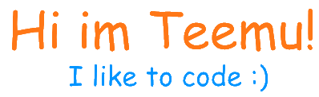

**About me**

- 🔭I am currently working as a Front-end developer
- 📚I am studying Computer Science/Information Technology  
- 🖥In my personal projects I do mainly full-stack and mobile(with varying degrees of success)
- 👨‍💻Currently I am working mainly with <strong> Python </strong> (Cybsec), <strong> Next.js, React and SQL</strong>
- 🔍I am interested to learn more about machine learning, AI and modern software development tools and frameworks  

On my free time I like to train muay thai🥊, play videogames🎮, go to the gym💪 and of course, code🤓  

Feel free to message me anywhere/anytime! :)

) 

✨ [My Website](https://www.teemuh.com) ✨
